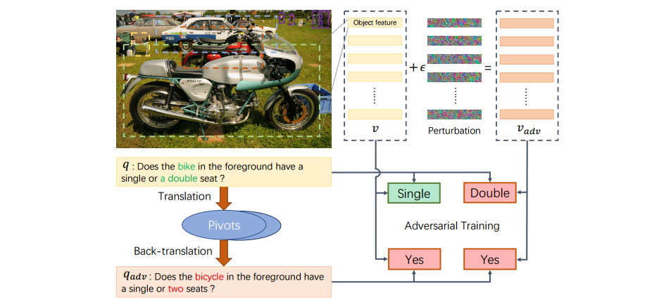

# 用于视觉问答的语义等效对抗性数据扩展

工具：pytorch

这个仓库是对 ECCV 2020 的论文 *Semantic Equivalent Adversarial Data Augmentation for Visual Question Answering*的代码复现。




# 目录

工具复现

- 工具验证
- 运行视频
- 项目文档
- 代码规范
- 复现难度

工具理解

- 核心算法
- 功能模块
- 输入输出
- PPT展示
- 复现难度


按照评分标准写README


## 依赖

你可能需要至少**1个GPU**，**11GB内存用于训练，以及**200GB可用磁盘空间用于存储VQAv2数据集。我们强烈建议使用SSD驱动器，以保证高速I/O。

- Python 3.6
  - pytorch = 1.0
  - torchvision 0.2
  - h5py 2.7
  - tqdm 4.19

## 安装

1. ```
   git clone https://github.com/zaynmi/seada-vqa.git
   ```

2. 我们建议所有事情都在anaconda环境下进行

   ```
   conda create -n seada python=3.6
   source activate seada
   ```

3. 安装 Pytorch 1.0 和 torchvision 

   ```
   conda install pytorch=1.0 torchvision cudatoolkit=10.0 -c pytorch
   ```

4. 安装其它依赖:

   ```
   pip install -r requirements.txt
   python -m spacy download en
   ```

5. 安装[OpenNMT-py](https://github.com/OpenNMT/OpenNMT-py) 用于生成paraphrases, 它允许在你的环境中安装`onmt`包。: 

   ```
   git clone https://github.com/zaynmi/OpenNMT-py.git
   cd OpenNMT-py
   python setup.py install
   cd ..
   ```

6. 下载并解压 [the translation models](https://drive.google.com/open?id=1b2upZvq5kM0lN0T7YaAY30xRdbamuk9y) 放进 `seada/sea/translation_models` 文件夹. 你会得到四个 `.pt` 模型.

## Prepare Dataset (Follow [Cyanogenoid/vqa-counting](https://github.com/Cyanogenoid/vqa-counting))

- In the `data` directory, execute `./download.sh` to download VQA v2 and the bottom-up-top-down features.
- Prepare the data by running

```
python data/preprocess-features.py
python data/preprocess-vocab.py
```

This creates an `h5py` database (95 GiB) containing the object proposal features and a vocabulary for questions and answers at the locations specified in `config.py`. It is strongly recommended to put database in SSD. 

## Training

### Step 1: Generating the paraphrases of questions

```
python main.py --attack_only --attack_mode q --attack_al sea --attacked_checkpoint {your_trained_model}.pth --fliprate 0.3 --topk 2 --paraphrase_data train
```

This would generate paraphrases of train set with top-2 semantic similarity score and 30% flip rate considering `{your_trained_model}.pth` ([A BUTD model](https://drive.google.com/file/d/1mXm9R968zxzWz8GYkpRnn3k4yzgwcXdz/view?usp=sharing)), and store them in `config.paraphrase_save_path`. Similarly, by setting `--paraphrase_data val`, you can get paraphrases of val set. Don't forget to change `config.paraphrase_save_path` accordingly. 

In our paper, we didn't specify the flip rate ,  topk and attacked_checkpoint (`--fliprate 0, --topk 1`), which means we simply use paraphrases with top-1 semantic similarity score.

There is another step left.  We need to sort the generated paraphrases in the same order with annotations file.  The script is in  `sort_para.py`

### Step 2: Adversarial training

- **Option-1**. Use both visual adversarial examples and paraphrases to augment data.

  ```
  python main.py --advtrain --attack_al ifgsm,sea --attack_mode vq --attacked_checkpoint {checkpoint_you_attack_when_eval}.pth  --resume {your_partial_trained_model}.pth
  ```

- **Option-2**. Use visual adversarial examples to augment data.

  ```
  python main.py --advtrain --attack_al ifgsm --attack_mode v --attacked_checkpoint {checkpoint_you_attack_when_eval}.pth  --resume {your_partial_trained_model}.pth
  ```

- **Option-3**. Use paraphrases to augment data.

  ```
  python main.py --advtrain --attack_al sea --attack_mode q --attacked_checkpoint {checkpoint_you_attack_when_eval}.pth  --resume {your_partial_trained_model}.pth
  ```

`--attacked_checkpoint` is optional, which allows you to evaluate the performance of adversarially trained model defense against adversarial examples generated by `{checkpoint_you_attack_when_eval}.pth`

If you want to train with train and val set, add `--advtrain_data trainval`

## Evaluation

- Generate `.json` file for you to upload to on-line evaluation server. The result file is specified in `config.result_json_path`.

```
python main.py --test_advtrain --checkpoint {your_trained_model}.pth
```

- Or you can evaluate on the val set. `--attacked_checkpoint` is optional and if it is declared, you would see the performance of defense.

```
python main.py --eval_advtrain --checkpoint {your_trained_model}.pth --attack_al ifgsm --attack_mode v --attacked_checkpoint {checkpoint_you_attack_when_eval}.pth 
```

## Performance of the model when being attacked

How our model behaves when attacked by the attackers is of great concern to us too. You can use

```
python main.py --attack_only --attack_mode v --attack_al pgd --alpha 0.5 --iteration 6 --epsilon 5 --attacked_checkpoint {checkpoint_being_attacked}.pth 
```

All the attackers act as a white-box attacker.

