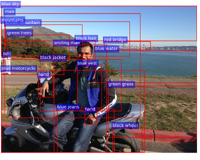
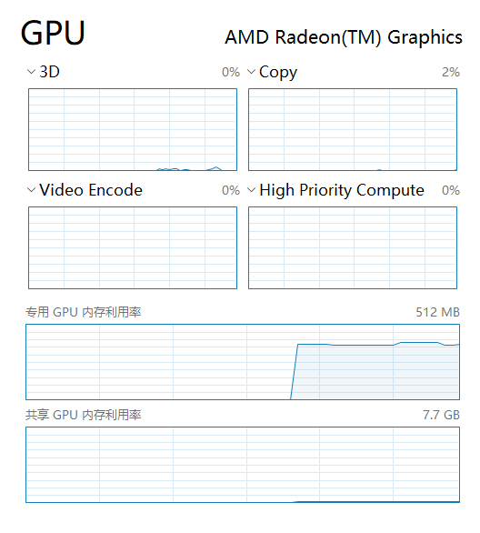
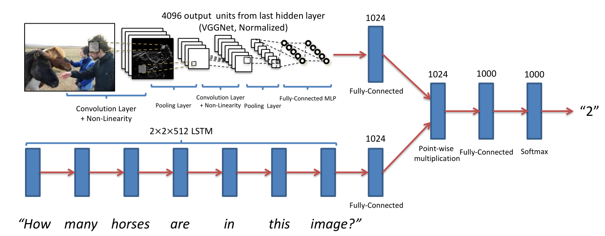
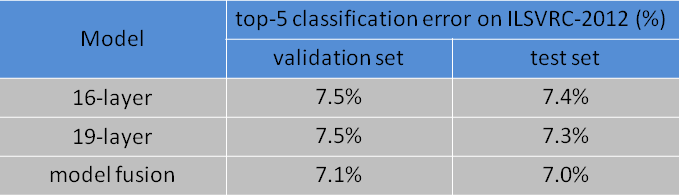
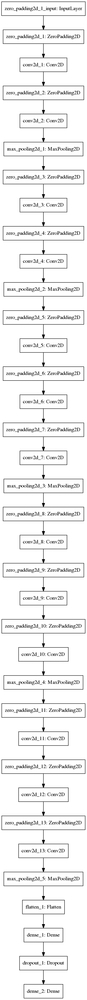
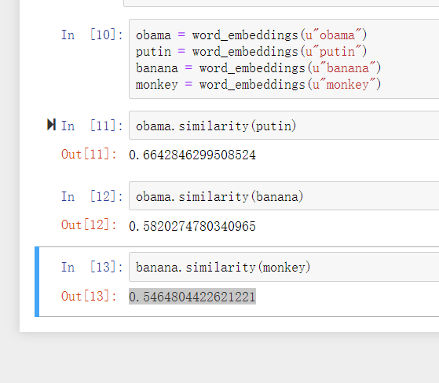
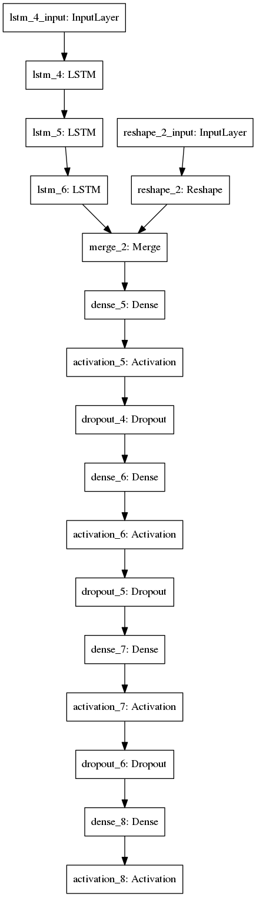
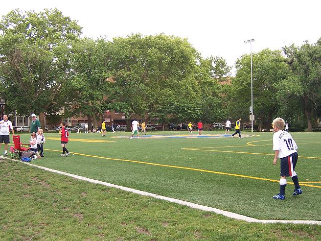

# VQA_Demo

[toc]

## 开始的想法

论文中使用的是Bottom-Up-Attention and TopDown (BUTD) ，它结合了自下而上和自上而下的

注意力机制来执行VQA。自下而上的机制从Faster R-CNN中生成对象建议，自上而下的机制预测

这些建议的注意力分布。

该模型在2017年VQA挑战赛中获得第一名。



> 参考文献：
>
> *Bottom-up and top-down attention for image captioning and visual question answering*
>
> *Proceedings of the IEEE international conference on computer vision*

但是由于BUTD的运行要求，我决定放弃使用这个VQA框架。

BUTD要求：

任何拥有12GB或更大内存的NVIDIA GPU，用于训练Faster R-CNN ResNet-101，200GB或更大的存储空间用于存放训练数据。

我查看了一下自己电脑的GPU，仅仅512MB且为AMD类型。

于是选择放弃这个方案。



## 我使用的VQA架构

BUTD的硬件要求使得我在没有实验室设备支持的情况下无法顺利进行这项实验。

考虑到这次复现起到的绝大部分是演示作用，我决定采用一个简单的VQA demo，该demo由VGG Net (VGG-16)和斯坦福大学的Word2Vec(Glove)组成，采用一个简单的模型，合了图像和词嵌入的特征并运行一个多层感知器。

这个工具是用来演示VQA的，因此重点在于简单而不是速度。为了方便演示，采用的是web的jupyter book形式。

适用于Keras 2.0和TF 1.2以及Spacy 2.0。

这个工具是用来演示VQA的，因此重点在于简单而不是速度。

这是一个简单的VQA演示，它使用预训练的模型（见`models/CNN`和`models/VQA`）来回答关于给定图像的给定问题。

经过验证，它虽然不能进行大批量的数据验证，但是作为自动化工具复现的角度来说，足够我们使用了。

### 依赖

1. Keras 2.0以上版本

   * 基于python的模块化深度学习库

2. Tensorflow 1.2+

3. scikit-learn

   * python的基本机器库

4. Spacy version 2.0+

   *  用来加载Glove向量（word2vec）。
   * 要升级和安装Glove向量
   * python -m spacy download en_vectors_web_lg
   * 
     * python -m spacy download en_vectors_web_lg

5. OpenCV 

   * OpenCV只用于调整图像的大小和改变颜色通道。
   * 你可以使用其他库，只要你能传递一个224x224的BGR图像（注意：BGR而不是RGB）。

6. VGG 16预训练权重

   * 请下载权重文件 [vgg16_weights.h5](https://drive.google.com/file/d/1xJbtMZzKv62PaohN1fRySZR6l9gHTz6Z/view?usp=sharing)

部分安装指令：

安装cv2

`conda install opencv`

安装matplotlib

`conda install matplotlib`

安装sklearn(conda下的名字不太一样)

`conda install -c anaconda scikit-learn`

## 代码分解

### 开始准备

#### 载入目录

``` python
%matplotlib inline
import warnings
warnings.filterwarnings("ignore")
import os, argparse
import cv2, spacy, numpy as np
from keras.models import model_from_json
from keras.optimizers import SGD
# from sklearn.externals import joblib
# sklearn.externals.joblib函数是用在0.21及以前的版本中，在最新的版本中，该函数应被弃用。
import joblib
from keras import backend as K
from keras.utils.vis_utils import plot_model
K.set_image_data_format('channels_first')
```

#### 载入模型和权重

``` python
# 除了CNN_weights，其它所有都在目录中提供，CNN_weights在google drive中下载
VQA_model_file_name      = 'models/VQA/VQA_MODEL.json'
VQA_weights_file_name   = 'models/VQA/VQA_MODEL_WEIGHTS.hdf5'
label_encoder_file_name  = 'models/VQA/FULL_labelencoder_trainval.pkl'
CNN_weights_file_name   = 'models/CNN/vgg16_weights.h5'
```

##### 模型原理

这使用了一个经典的CNN-LSTM模型，如下图所示，图像特征和语言特征被分别计算并结合在一起，使用一个多层感知器被用于训练综合特征。



类似的模型如下，这项工作从他们那里获得了灵感。

1. https://github.com/abhshkdz/neural-vqa
2. https://github.com/avisingh599/visual-qa
3. https://github.com/VT-vision-lab/VQA_LSTM_CNN

### 图像特征提取

#### 预训练 VGG Net (VGG-16)

虽然VGG Net并不是图像特征最好的CNN模型，GoogLeNet（2014年冠军）和ResNet（2015年冠军）的分类分数更胜一筹，但VGG Net的功能非常多，简单，相对较小，更重要的是使用起来方便。

作为参考，这里是VGG 16在ILSVRC-2012上的表现 



#### 读取模型

```python
def get_image_model(CNN_weights_file_name):
    # 接收CNN权重文件
    # 返回带有该权重的VGG模型更新
    # 需要使用models/CNN中的VGG.py文件
    from models.CNN.VGG import VGG_16
    image_model = VGG_16(CNN_weights_file_name)
    image_model.layers.pop()
    image_model.layers.pop()
    # 不包含最后两层的标准VGG文件
    sgd = SGD(lr=0.1, decay=1e-6, momentum=0.9, nesterov=True)
    image_model.compile(optimizer=sgd, loss='categorical_crossentropy')
    return image_model
```

#### 绘制模型

Keras有一个功能，可以让你在方框图中可视化模型。

```python
model_vgg = get_image_model(CNN_weights_file_name)
plot_model(model_vgg, to_file='model_vgg.png')
```

如下：



#### 提取图像特征

原先的特征提取逻辑是：

取原始图像，通过模型网络一直运行，直到到达最后一层。

我们不打算使用VGG的最后两层，因为VGG Net的最后一层是1000路softmax，而最后第二层是Dropout。

从VGG-16中提取4096维的图像特征的过程

```python
def get_image_features(image_file_name):
    # 使用给定的图像文件运行VGG 16模型
    # 将权重作为(1,4096)维向量返回
    image_features = np.zeros((1, 4096))

    # 由于VGG被训练成224x224的图像，每一个新图形都需要经过同样的转换
    im = cv2.resize(cv2.imread(image_file_name), (224, 224))
    # 把图像转为RGBA格式
    im = im.transpose((2,0,1)) 

    
    # 这个轴的维度是必须的，因为VGG是在1, 3, 224, 224维度上训练的
    # 尽管我们只使用一张图片，但我们必须保持维度的一致
    im = np.expand_dims(im, axis=0) 

    image_features[0,:] = model_vgg.predict(im)[0]
    return image_features
```

### 文字嵌入

问题必须被转换为某种形式的词嵌入。

最流行的是Word2Vec，而现在的技术水平是使用[skip-thought vectors](https://github.com/ryankiros/skip-thoughts)或[positional encodings](https://en.wikipedia.org/wiki/Encoding_(内存))。

我们使用斯坦福大学的Word2Vec，称为[Glove](http://nlp.stanford.edu/projects/glove/)。Glove将一个给定的标记简化为300维的表示。

```python
def get_question_features(question):
    # 对于一个给定的问题，一个unicode字符串，返回使用Glove Vector计算的时间序列向量
    word_embeddings = spacy.load('en_vectors_web_lg')
    tokens = word_embeddings(question)
    question_tensor = np.zeros((1, 30, 300))
    for j in range(len(tokens)):
        question_tensor[0,j,:] = tokens[j].vector
    return question_tensor
```

#### 尝试嵌入

首先需要安装语言库

`conda install -c conda-forge spacypython -m spacy download en_core_web_sm`

`python -m spacy download en_vectors_web_lg`

让我们来看看这些嵌入，以及它们在样本词中的用法，比如说

1. Obama
2. Putin
3. Banana
4. Monkey

```python
# from spacy.lang.en import English
# word_embeddings = English(vectors='en_glove_cc_300_1m_vectors')
# 如果是spacy3.0，用上面的方法
word_embeddings = spacy.load('en_core_web_sm', vectors='en_glove_cc_300_1m_vectors')
```

```python
obama = word_embeddings(u"obama")
putin = word_embeddings(u"putin")
banana = word_embeddings(u"banana")
monkey = word_embeddings(u"monkey")
```

In:

```python
obama.similarity(putin)
```

Out:

```python
0.6642846299508524
```

In:

```python
obama.similarity(banana)
```

Out:

```python
0.5820274780340965
```

In:

```python
banana.similarity(monkey)
```

Out:

```python
0.5464804422621221
```




我们可以看到，与奥巴马和香蕉相比，奥巴马和普京在表示上非常相似。这表明在300个维度的表征中嵌入了一些标记的语义知识。我们可以用这些word2vec做很酷的算术，比如'女王'-'国王'+'男孩'='女孩'。更多细节见[本博文](http://multithreaded.stitchfix.com/blog/2015/03/11/word-is-worth-a-thousand-vectors/)。

### VQA模型

VQA是一个简单的模型，它结合了图像和词嵌入的特征并运行一个多层感知器。

```python
def get_VQA_model(VQA_model_file_name, VQA_weights_file_name):
    # 给定VQA模型和它的权重，编译并返回更新后的模型
    vqa_model = model_from_json(open(VQA_model_file_name).read())
    vqa_model.load_weights(VQA_weights_file_name)
    vqa_model.compile(loss='categorical_crossentropy', optimizer='rmsprop')
    return vqa_model
```

```python
model_vqa = get_VQA_model(VQA_model_file_name, VQA_weights_file_name)
plot_model(model_vqa, to_file='model_vqa.png')
```

模型可视化图像如下：



## 运行

让我们给出一个测试图像和一个问题

```python
image_file_name = 'test.jpg'
question = u"What vehicle is in the picture?"
```

# What vehicle is in the picture ?


```python
# 获得图像特征
image_features = get_image_features(image_file_name)
```

```python
# 获取问题特征
question_features = get_question_features(question)
```

```python
y_output = model_vqa.predict([question_features, image_features])
warnings.filterwarnings("ignore", category=DeprecationWarning)
labelencoder = joblib.load(label_encoder_file_name)
for label in reversed(np.argsort(y_output)[0,-5:]):
    print(str(round(y_output[0,label]*100,2)).zfill(5), "% ", labelencoder.inverse_transform(label.reshape(-1,1)))
```

结果

**51.87 % train
031.5 % bicycle
03.81 % bike
02.91 % bus
02.54 % scooter**

可见，预测结果还是比较准确的，我们不妨多进行几次测试。

```python
image_file_name = "indparksoccerkids.jpg"
image_features = get_image_features(image_file_name)
```



# What are they playing?

```python
question = u"What are they playing?"
question_features = get_question_features(question)
```

```python
y_output = model_vqa.predict([question_features, image_features])
warnings.filterwarnings("ignore", category=DeprecationWarning)
labelencoder = joblib.load(label_encoder_file_name)
for label in reversed(np.argsort(y_output)[0,-5:]):
    print(str(round(y_output[0,label]*100,2)).zfill(5), "% ", labelencoder.inverse_transform(label.reshape(-1,1)))
```

结果

**55.44 % frisbee
18.91 % tennis
16.95 % baseball
08.31 % soccer
00.07 % ball
**

它犯了个错误，但是是情有可原的，因为这个场地缺乏足球和边缘的线。

我们可以试着再问一个问题：

```python
question = u"Are they playing Frisbee?"
question_features = get_question_features(question)
```


# Are they playing Frisbee? 

结果

**78.72 % yes
21.28 % no
000.0 % girl
000.0 % halloween
000.0 % left**

> 参考：
>
> [预训练模型上的视觉问答演示](https://github.com/iamaaditya/VQA_Demo)

