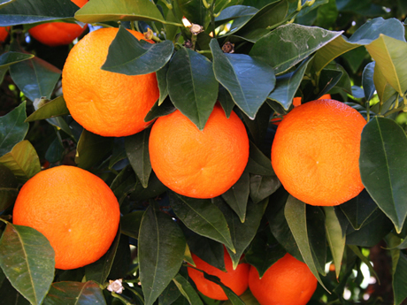
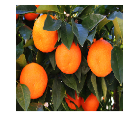
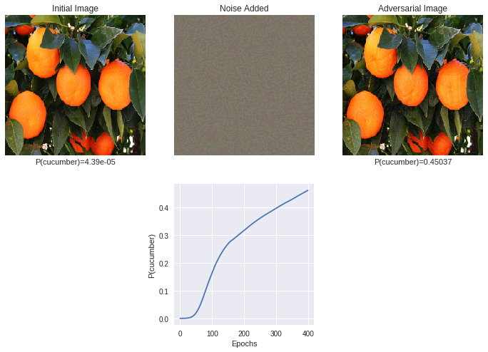

> 论文：Adversarial examples in the physical world
- [对抗样本是什么？](#对抗样本是什么)
- [生成对抗样本的方法](#生成对抗样本的方法)
  - [FGSM-快速方法](#fgsm-快速方法)
  - [IFGSM-基础迭代方法](#ifgsm-基础迭代方法)
- [IFGSM-Demo](#ifgsm-demo)
  - [依赖](#依赖)
- [有目标对抗攻击](#有目标对抗攻击)
  - [代码分解](#代码分解)
    - [导入依赖](#导入依赖)
    - [加载VGG-16预训练模型](#加载vgg-16预训练模型)
    - [第一次预测](#第一次预测)
    - [梯度攻击](#梯度攻击)
- [无目标对抗攻击](#无目标对抗攻击)
  - [代码分解](#代码分解-1)
    - [导入依赖](#导入依赖-1)
    - [加载VGG16预训练模型](#加载vgg16预训练模型)
    - [第一次预测](#第一次预测-1)
    - [梯度攻击](#梯度攻击-1)

## 对抗样本是什么？

对抗样本（adversarial examples）和对抗学习（GAN）截然不同，这一概念在[Szegedy](https://link.zhihu.com/?target=https%3A//arxiv.org/pdf/1312.6199.pdf)[ et al. (2014b)](https://link.zhihu.com/?target=https%3A//arxiv.org/pdf/1312.6199.pdf)中提出：对输入样本故意添加一些人无法察觉的细微的干扰，导致模型以高置信度给出一个错误的输出。

1. 可以针对一张已经有正确分类的image，对其进行细微的像素修改，可以在DNN下被错分为其他label。

   样本x的label为熊猫，在对x添加部分干扰后，在人眼中仍然分为熊猫，但对深度模型，却将其错分为长臂猿，且给出了高达99.3%的置信度。


2. 像素攻击：改动图片上的一个像素，就能让神经网络认错图，甚至还可以诱导它返回特定的结果。

   改动图片上的一个像素，就能让神经网络认错图，甚至还可以诱导它返回特定的结果。

3. 同样，根据DNN，很容易产生一张在人眼下毫无意义的image，但是在DNN中能够获得高confidence的label。

   两种EA算法生成的样本，这些样本人类完全无法识别，但深度学习模型会以高置信度对它们进行分类，例如将噪声识别为狮子。

现有的大多数机器学习分类器极易受到对抗样本的攻击。

一个对抗样本是输入数据的样本，该样本已以某种方式稍加修改，目的是使机器学习分类器对其进行错误分类。

在许多情况下，这些修改可能非常微妙，以至于人类观察者甚至根本不会注意到该修改，但是分类器仍然会犯错误。

对抗样本带来了安全隐患，因为即使无法访问潜在的模型，它们也可以用于对机器学习系统进行攻击。

到目前为止，所有以前的工作都采用了一种威胁模型，在该模型中，对手可以将数据直接输入到机器学习分类器中。

对于在物理世界中运行的系统，例如使用摄像头和其他传感器的信号作为输入的系统，并非总是如此。

机器学习和深度神经网络的最新进展使研究人员能够解决多个重要的实际问题，例如图像、视频、文本分类等。

但是，机器学习模型在对抗操作面前非常脆弱，从而导致错误的分类。

尤其是，神经网络和许多其他类别的机器学习模型非常容易受到攻击，**这些攻击是基于在测试时对模型输入的少量修改而造成的。**

问题可以总结如下

> 假设有一个机器学习系统M和输入样本C，我们称之为干净样本。
>
> 假设样本C已经由机器学习系统正确分类，即，可以构造一个对抗样本A，该样本在感知上与C无法区分，但是分类不正确，即。
>
> 和带有噪声的样本相比，对抗样本更容易被分类错误，即使噪声的量级远大于对抗的扰动。

## 生成对抗样本的方法

参数定义如下：

- X：图像，通常为3-D张量（宽度×高度×深度），假设像素的值是[0，255]范围内的整数

- $y_{\text {true }}$：图像X的真实类别

- $J(X, y)$：给定图像X和类y，神经网络的交叉熵损失函数。我们有意在损失函数中忽略了网络权重（和其他参数），因为我们认为在本文中它们是固定的（固定为训练机器学习模型所得到的值）$\theta$。对于具有softmax输出层的神经网络，给定图像，应用于整数类别标签的交叉熵代价函数等于真实类别的负对数概率：$J(X, \quad y)=-\log p(y \mid X)$

  这个关系将在下面被使用：

  Clip $_{X, \epsilon}\left\{X^{\prime}\right\}$：裁剪函数，z指的是通道

  $\operatorname{Clip}_{X, \epsilon}\left\{X^{\prime}\right\}(x, y, z)=\min \left\{255, X(x, y, z)+\epsilon, \max \left\{0,(x, y, z)-\epsilon, X^{\prime}(x, y, z)\right\}\right\}$

### FGSM-快速方法

Goodfellow中描述的最简单的生成对抗图像的方法之一是通过线性化损失函数并求解扰动来最大化受$L_{\infty}$约束的扰动，可以以解析解的方式完成此操作，但需要进行一次反向传播的调用：
$$
X^{a d v}=X+\epsilon \operatorname{sign}\left(\nabla_{x} J\left(X, y_{\text {true }}\right)\right)
$$

### IFGSM-基础迭代方法

我们引入了一种简单的方法来扩展“快速”方法，我们以较小的步长将其多次应用，并在每一步之后剪切中间结果的像素值，以确保它们位于原始图像的值域中：
$$
X_{0}^{a d v}=X, \quad X_{N+1}^{a d v}=C l i p_{X, \epsilon}\left\{X_{N}^{a d v}+\alpha \operatorname{sign}\left(\nabla_{x} J\left(X_{N}^{a d v}, y_{\text {true }}\right)\right)\right\}
$$

## IFGSM-Demo

### 依赖

1. Keras

   TensorFlow backend

2. numpy

3. matplotlib

   演示绘图使用

4. 模型

   https://github.com/fchollet/deep-learning-models/releases/download/v0.1/vgg16_weights_tf_dim_ordering_tf_kernels.h5

## 有目标对抗攻击

### 代码分解

#### 导入依赖

``` python
import numpy as np
from keras.applications import vgg16
from keras.preprocessing import image
from keras.activations import relu, softmax
import keras.backend as K
import matplotlib.pyplot as plt
%matplotlib inline
```

#### 加载VGG-16预训练模型

``` pyhton
model = vgg16.VGG16(weights='imagenet')
```

#### 第一次预测

``` python
img_path = 'orange.jpg'
img = image.load_img(img_path, target_size=(224,224))

plt.imshow(img)
plt.grid('off')
plt.axis('off')

# 图片处理和特征值提取
x = image.img_to_array(img)
x = np.expand_dims(x, axis=0)
x = vgg16.preprocess_input(x)

# 获得开始时的预测
preds = model.predict(x)
initial_class = np.argmax(preds)
print('Predicted:', vgg16.decode_predictions(preds, top=3)[0])
```



结果如下：

**Predicted: [('n07747607', 'orange', 0.9942152), ('n07749582', 'lemon', 0.0041732006), ('n03991062', 'pot', 0.00032574133)]**

可以看到，是比较准确的。

``` python
# 逆推预处理的过程并画出图像
def plot_img(x):
    """
    x is a BGR image with shape (? ,224, 224, 3) 
    """
    t = np.zeros_like(x[0])
    t[:,:,0] = x[0][:,:,2]
    t[:,:,1] = x[0][:,:,1]
    t[:,:,2] = x[0][:,:,0]  
    plt.imshow(np.clip((t+[123.68, 116.779, 103.939]), 0, 255)/255)
    plt.grid('off')
    plt.axis('off')
    plt.show()

# 看看有没有变化
plot_img(x)
```



肉眼基本看不出来有什么变化。

#### 梯度攻击

下面进行梯度攻击，获取新的图像并进行预测。

``` python
# 设置变量
epochs = 100
epsilon = 0.01
target_class = 943 # cucumber
prev_probs = []

for i in range(epochs): 
    target = K.one_hot(target_class, 1000)
    
    # 获得损失和相对于输入的损失梯度
    loss = -1*K.categorical_crossentropy(target, model.output)
    grads = K.gradients(loss, model.input)

    # 获取梯度符号
    delta = K.sign(grads[0])
    x_noise = x_noise + delta

    # 扰乱图像
    x_adv = x_adv + epsilon*delta

    # 获取新的图像进行预测
    x_adv = sess.run(x_adv, feed_dict={model.input:x})
    preds = model.predict(x_adv)

    prev_probs.append(preds[0][target_class])

    if i%20==0:
        print(i, preds[0][target_class], vgg16.decode_predictions(preds, top=3)[0])

plot_img(x_adv)
plot_img(x_adv-x)
```

结果如下：

```
0 4.3977587e-05 [('n07747607', 'orange', 0.99379504), ('n07749582', 'lemon', 0.00440125), ('n03991062', 'pot', 0.00035894263)]
20 0.0008221095 [('n07747607', 'orange', 0.9743702), ('n07749582', 'lemon', 0.01145205), ('n03991062', 'pot', 0.0020397978)]
40 0.008314591 [('n07747607', 'orange', 0.90192163), ('n07749582', 'lemon', 0.024204142), ('n07718472', 'cucumber', 0.008314591)]
60 0.04159412 [('n07747607', 'orange', 0.7212007), ('n07718472', 'cucumber', 0.04159412), ('n07749582', 'lemon', 0.03562256)]
80 0.104958005 [('n07747607', 'orange', 0.46788505), ('n07718472', 'cucumber', 0.104958005), ('n07749582', 'lemon', 0.037138414)]
```

会发现，经过几次迭代之后，预测成功的准确率迅速下降。

而预测成为目标类别，也就是`cucumber`迅速上升：



## 无目标对抗攻击

### 代码分解

#### 导入依赖

``` python
import numpy as np
from keras.applications import vgg16
from keras.preprocessing import image
from keras.activations import relu, softmax
import keras.backend as K
import matplotlib.pyplot as plt
%matplotlib inline
```

#### 加载VGG16预训练模型

``` python
model = vgg16.VGG16(weights='imagenet')
```

#### 第一次预测

``` python
# 导入火烈鸟图片
img_path = 'flamingo.jpg'
img = image.load_img(img_path, target_size=(224,224))

plt.imshow(img)
plt.grid('off')
plt.axis('off')

# 和之前一样
x = image.img_to_array(img)
x = np.expand_dims(x, axis=0)
x = vgg16.preprocess_input(x)

# 第一次预测
preds = model.predict(x)
initial_class = np.argmax(preds)
print('Predicted:', vgg16.decode_predictions(preds, top=3)[0])
```


结果如下：

```
Predicted: [('n02007558', 'flamingo', 0.99999607), ('n02006656', 'spoonbill', 1.8544616e-06), ('n02009912', 'American_egret', 8.5071696e-07)]
```

结果显示，它是一只火烈鸟。

#### 梯度攻击

下面进行梯度攻击，获取新的图像并进行预测。

``` python
# 设置变量
epochs = 400
epsilon = 0.01
prev_probs = []

for i in range(epochs): 
    target = K.one_hot(initial_class, 1000)
    
    loss = K.categorical_crossentropy(target, model.output)
    grads = K.gradients(loss, model.input)

    delta = K.sign(grads[0])
    x_noise = x_noise + delta

    x_adv = x_adv + epsilon*delta

    x_adv = sess.run(x_adv, feed_dict={model.input:x})
    preds = model.predict(x_adv)

    prev_probs.append(preds[0][initial_class])

    if i%20==0:
        print(i, preds[0][initial_class], vgg16.decode_predictions(preds, top=3)[0])

plot_img(x_adv)
plot_img(x_adv-x)
```

结果如下：

```
0 0.9999956 [('n02007558', 'flamingo', 0.9999956), ('n02006656', 'spoonbill', 2.0940493e-06), ('n02009912', 'American_egret', 9.710699e-07)]
20 0.9999491 [('n02007558', 'flamingo', 0.9999491), ('n02006656', 'spoonbill', 1.9610497e-05), ('n02009912', 'American_egret', 1.08507675e-05)]
40 0.999637 [('n02007558', 'flamingo', 0.999637), ('n02006656', 'spoonbill', 0.00011842114), ('n02009912', 'American_egret', 7.331572e-05)]
60 0.99812275 [('n02007558', 'flamingo', 0.99812275), ('n02006656', 'spoonbill', 0.0005140069), ('n02009912', 'American_egret', 0.00035199246)]
80 0.99239904 [('n02007558', 'flamingo', 0.99239904), ('n02006656', 'spoonbill', 0.0017014268), ('n02009912', 'American_egret', 0.0012523659)]
100 0.976348 [('n02007558', 'flamingo', 0.976348), ('n02006656', 'spoonbill', 0.004375022), ('n02012849', 'crane', 0.0034781264)]
120 0.93764174 [('n02007558', 'flamingo', 0.93764174), ('n02006656', 'spoonbill', 0.009315101), ('n02012849', 'crane', 0.00835958)]
140 0.85389256 [('n02007558', 'flamingo', 0.85389256), ('n02012849', 'crane', 0.017473213), ('n02006656', 'spoonbill', 0.017150726)]
```

发现预测是火烈鸟的准确率迅速下降。

